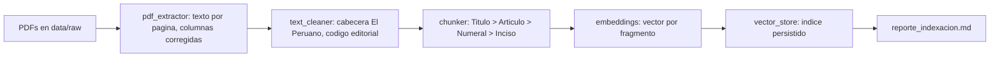
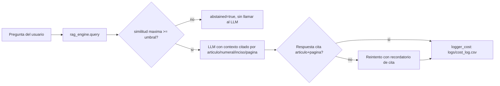
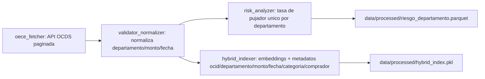
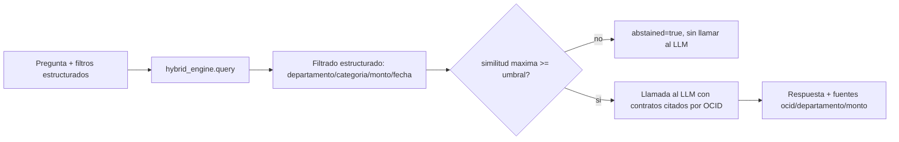

# Pipeline del Proyecto Integrador

## Árbol del repositorio

```text
.
├── README.md
├── requirements.txt
├── .env.example
├── .gitignore
├── tarea1_rag_normativo/
│   ├── config.yaml
│   ├── source_check.py
│   ├── build_index.py
│   ├── app.py
│   ├── src/
│   │   ├── pdf_extractor.py
│   │   ├── text_cleaner.py
│   │   ├── chunker.py
│   │   ├── embeddings.py
│   │   ├── vector_store.py
│   │   ├── rag_engine.py
│   │   └── logger_cost.py
│   ├── eval/
│   │   ├── preguntas.csv
│   │   ├── evaluate_retrieval.py
│   │   └── resultados.csv
│   ├── docs/
│   │   ├── reporte_extraccion.md
│   │   ├── reporte_indexacion.md
│   │   └── reporte_embeddings.md
│   ├── data/{raw,processed}/
│   └── logs/
├── tarea2_radar/
│   ├── config.yaml
│   ├── build_index.py
│   ├── app.py
│   ├── src/
│   │   ├── oece_fetcher.py
│   │   ├── validator_normalizer.py
│   │   ├── hybrid_indexer.py
│   │   ├── hybrid_engine.py
│   │   └── risk_analyzer.py
│   ├── eval/
│   │   ├── preguntas_radar.csv
│   │   └── evaluate_radar.py
│   ├── data/{raw,processed,geo}/
│   └── logs/
└── docs/pipeline.md
```

## Tarea 1 — flujo offline



`source_check.py` cubre A→C (inspección de fuentes, extracción, limpieza,
`docs/reporte_extraccion.md`). `build_index.py` cubre A→G de forma idempotente
(cada etapa se salta si su artefacto ya existe; `--force` fuerza reconstrucción
completa) y termina corriendo `eval/evaluate_retrieval.py` para incluir
Recall@k en el reporte. La fragmentación nunca cruza una página: un artículo
que continúa en la página siguiente genera fragmentos separados que heredan
la etiqueta de título/artículo vigente (estado secuencial por documento).

## Tarea 1 — flujo online



`app.py` (Streamlit) solo invoca `rag_engine.query()`; nunca reconstruye el
índice. `query()` retorna `citations_verified` para que la UI (o cualquier
consumidor) sepa si la respuesta final quedó con cita explícita de
artículo+página, en vez de confiar ciegamente en la instrucción del prompt.

## Tarea 2 — flujo offline



`build_index.py` reanuda el fetch desde `_fetch_state.json` y deduplica por
`ocid` en las etapas de normalización e indexación.

## Tarea 2 — flujo online



`app.py` (Streamlit) lee `contratos.parquet`, `riesgo_departamento.parquet` y
el índice híbrido ya construidos; el mapa coroplético usa el GeoJSON de los
25 departamentos configurado en `config.yaml -> geo`.

## Verificación de desacoplamiento motor/UI

```bash
grep -niE "streamlit|telegram" tarea1_rag_normativo/src/rag_engine.py tarea2_radar/src/hybrid_engine.py
```
